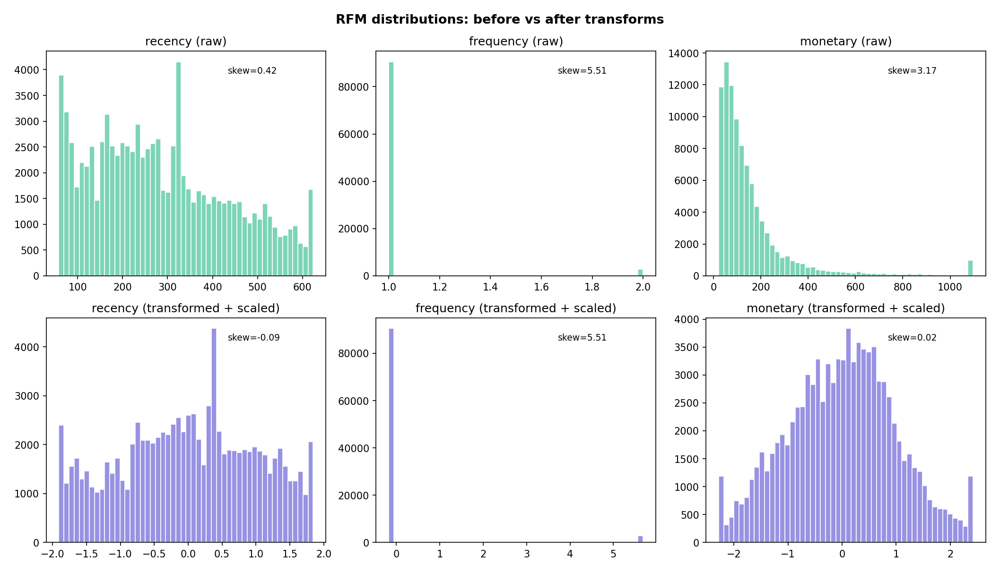
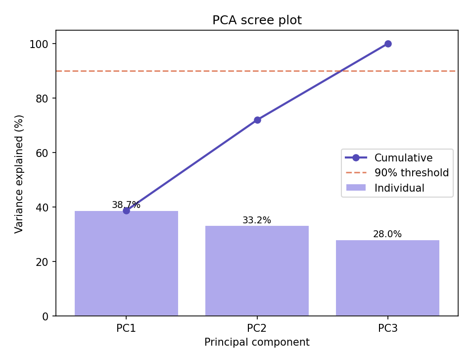
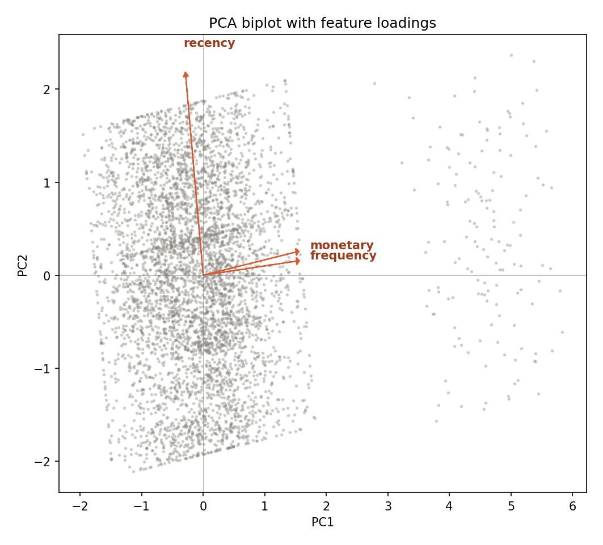
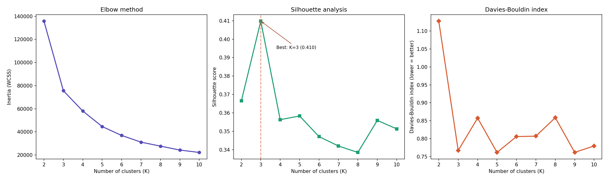
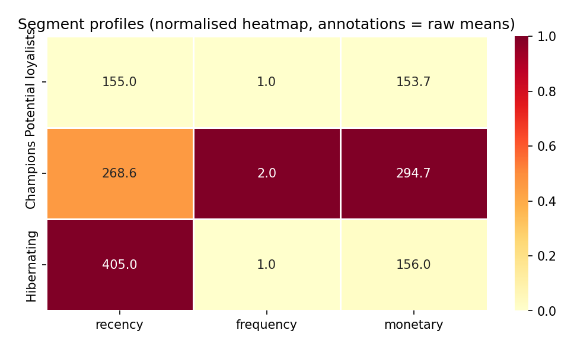
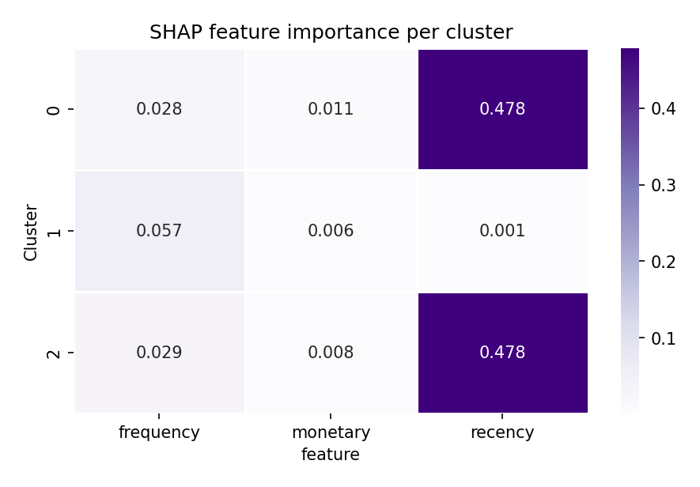
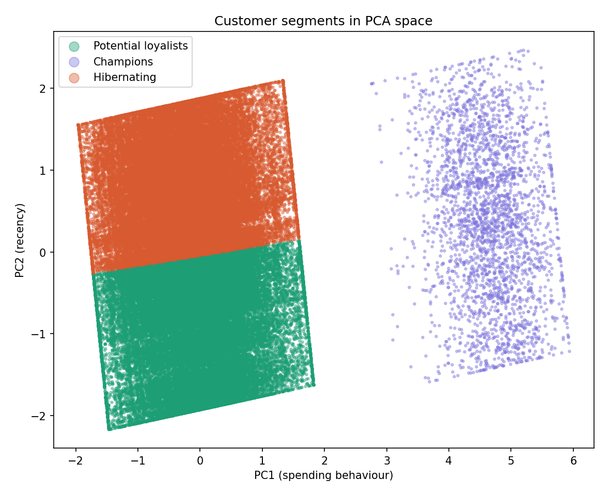
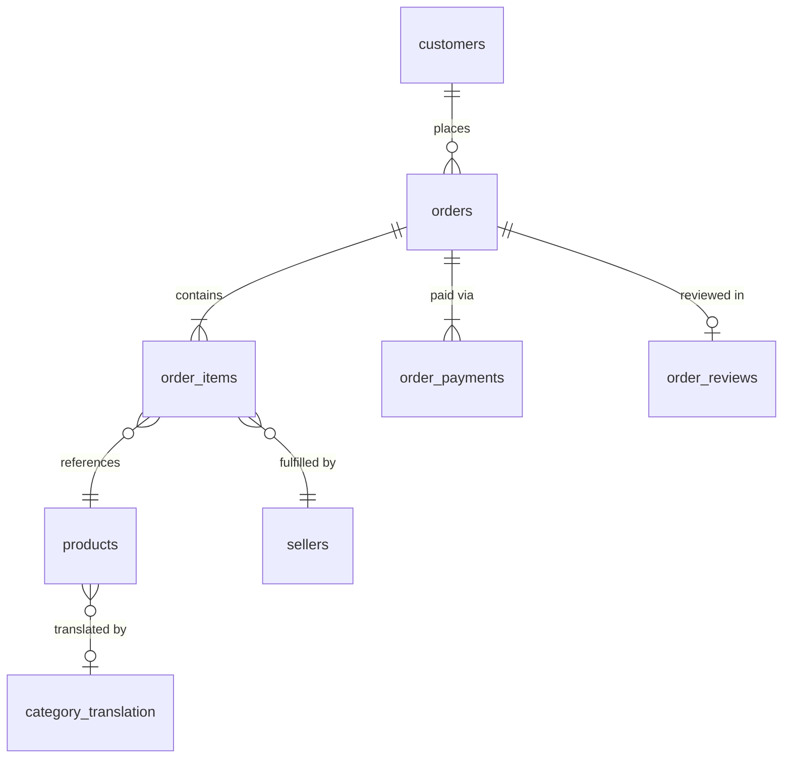

# Olist E-Commerce Analytics & Customer Segmentation

End-to-end analytics on 100K Brazilian e-commerce orders — from SQL analysis in BigQuery through an ML satisfaction model to a **4-phase unsupervised customer segmentation pipeline** using RFM, PCA, K-Means, and SHAP explainability.

## Highlights

| | |
|---|---|
| **93,357 customers** segmented into 3 actionable groups | K-Means silhouette score **0.4098** |
| SHAP explainability via proxy Random Forest (**99.99% accuracy**) | DBSCAN benchmark confirms K-Means superiority on this data |
| PCA reduces 3 RFM features to 2 components retaining **72% variance** | 8 diagnostic plots auto-generated per run |

---

## Business Context

[Olist](https://olist.com/) is a Brazilian e-commerce marketplace connecting small merchants to major online channels. Between September 2016 and October 2018, the platform processed ~100K orders across 27 states. This project answers:

> **How can Olist segment its 93,357 unique customers into actionable groups to drive targeted marketing — and which features matter most for each segment?**

---

## Customer Segmentation Pipeline

The segmentation is a 4-phase pipeline that transforms raw transactional data into labelled, explainable customer segments.

```
Phase 1                    Phase 2                Phase 3                    Phase 4
RFM Feature Engineering → PCA Dimensionality  → K-Means Clustering      → Segment Profiling
                          Reduction              + DBSCAN Benchmark        & SHAP Explainability
                          
• Aggregate orders        • Decorrelate features • Evaluate K=2..10       • Map clusters → labels
• Cap outliers (1/99%)    • Project to 2D        • Silhouette, CH, DB     • Normalised thresholds
• Log-transform skew      • 72% variance         • Compare DBSCAN         • Proxy RF + TreeSHAP
• Standardise (z-score)     retained             • Best K=3               • Per-segment importance
```

### Run the Pipeline

```bash
# All 4 phases + plot generation
python -m src.rfm_segmentation.pipeline

# Individual phases
python -m src.rfm_segmentation.pipeline 1 2 3 4

# Regenerate plots only
python -m src.rfm_segmentation.pipeline plots
```

---

### Phase 1: RFM Feature Engineering

Starting from 99,441 orders, the pipeline computes three features per customer:

| Feature | Definition | Raw Distribution |
|---|---|---|
| **Recency** | Days since last purchase (reference: 2018-10-18) | Right-skewed, range 1–641 days |
| **Frequency** | Number of distinct orders | Heavily skewed — 97% bought exactly once |
| **Monetary** | Total spend in BRL | Right-skewed with long tail |

**Transformations applied:**
1. **Outlier capping** at 1st and 99th percentiles — bounds extreme values without removing data
2. **Log₁₀ transform** — reduces skewness from 3.9→0.2 (frequency), 2.1→0.4 (monetary)
3. **StandardScaler** — zero-mean, unit-variance for distance-based algorithms



---

### Phase 2: PCA Dimensionality Reduction

PCA decorrelates the RFM features and projects them into a lower-dimensional space. With 3 features, PCA is primarily for decorrelation rather than compression — we retain 2 components (72% variance) for clustering.

| Component | Variance Explained | Interpretation |
|---|---|---|
| **PC1** | 38.7% | Spending behaviour (0.70×frequency + 0.70×monetary) |
| **PC2** | 33.2% | Recency (−0.99×recency) |
| PC3 | 28.0% | Residual variance |

**Loading vectors:** PC1 is dominated by frequency and monetary (both 0.70), making it a composite "spending" axis. PC2 is almost entirely recency (−0.99), creating a natural "time since purchase" axis.





---

### Phase 3: K-Means Clustering with DBSCAN Benchmark

**Optimal K selection** — evaluated K=2 through 10 using three metrics:

| K | Inertia | Silhouette ↑ | Calinski-Harabasz ↑ | Davies-Bouldin ↓ |
|---|---|---|---|---|
| 2 | 135,755 | 0.3665 | 45,267 | 1.1276 |
| **3** | **75,557** | **0.4098** | **77,854** | **0.7670** |
| 4 | 57,994 | 0.3563 | 77,047 | 0.8575 |
| 5 | 44,580 | 0.3583 | 82,193 | 0.7616 |

**K=3 was selected** — highest silhouette (0.4098), clear elbow in inertia, and near-best Davies-Bouldin.



#### DBSCAN Benchmark

DBSCAN was run as a validation benchmark (not as an alternative). The best DBSCAN result (eps at 90th percentile of k-distances, min_samples=10) achieved:

| Metric | K-Means (K=3) | DBSCAN (best) | Winner |
|---|---|---|---|
| Silhouette | **0.4098** | 0.1975 | K-Means (2× better) |
| Calinski-Harabasz | **77,854** | 85 | K-Means (900× better) |
| Davies-Bouldin | 0.7670 | **0.5391** | DBSCAN (but see note) |
| Noise points | **0** | 15–40% | K-Means |

> DBSCAN's lower Davies-Bouldin is an artefact — it excludes noise points (boundary customers) before computing the metric. K-Means assigns every customer to a segment, which is required for marketing use cases.

---

### Phase 4: Segment Profiling & SHAP Explainability

#### Three Customer Segments

| Segment | Cluster | Count | % | Recency (days) | Frequency | Monetary (BRL) |
|---|---|---|---|---|---|---|
| **Potential Loyalists** | 0 | 42,865 | 45.9% | 155 | 1.0 | 154 |
| **Champions** | 1 | 2,801 | 3.0% | 269 | 2.0 | 295 |
| **Hibernating** | 2 | 47,691 | 51.1% | 405 | 1.0 | 156 |



#### Labelling Methodology

Labels are assigned using **normalised RFM thresholds** (not arbitrary rules):

1. **Recency score** (inverted): `r_norm = 1 − (mean_recency − min) / (max − min)` — higher = more recent
2. **Value score**: average of normalised frequency and monetary — higher = more valuable
3. **Threshold at 0.5**: r ≥ 0.5 AND v ≥ 0.5 → Champions; r ≥ 0.5 AND v < 0.5 → Potential Loyalists; r < 0.5 → Hibernating

| Cluster | r_norm | v_norm | Label |
|---|---|---|---|
| 0 | **1.00** | 0.00 | Potential Loyalists (recent but low value) |
| 1 | **0.55** | **1.00** | Champions (recent AND high value) |
| 2 | 0.00 | 0.01 | Hibernating (not recent) |

#### SHAP Explainability

Since K-Means has no built-in feature importance, we train a **proxy Random Forest** (200 trees, max_depth=10) to predict cluster labels from raw RFM features, then extract SHAP values using TreeExplainer.

**Proxy validation:** 5-fold stratified CV accuracy = **0.9999 ± 0.0001** — the proxy perfectly reproduces K-Means assignments, so its SHAP values faithfully represent the clustering.

| Segment | Recency SHAP | Frequency SHAP | Monetary SHAP | Dominant Feature |
|---|---|---|---|---|
| Potential Loyalists | **0.4777** | 0.0279 | 0.0107 | Recency (92.6%) |
| Champions | 0.0008 | **0.0567** | 0.0056 | Frequency (89.9%) |
| Hibernating | **0.4784** | 0.0288 | 0.0076 | Recency (92.9%) |

**Key interpretation:**
- **Recency drives the two large segments.** Potential Loyalists and Hibernating differ only on when they last purchased (155 vs 405 days). Both have frequency=1.0 and nearly identical monetary values.
- **Frequency defines Champions.** The only repeat buyers in the dataset (frequency=2.0). Recency barely matters for this segment — Champions span a wide recency range.
- **Monetary is redundant.** After controlling for recency and frequency, monetary adds <2% discriminative power — because monetary correlates strongly with frequency (repeat buyers naturally spend more).



#### Segments in PCA Space



The scatter confirms the SHAP findings geometrically:
- **PC2 (vertical)** = recency axis → splits Potential Loyalists (bottom) from Hibernating (top)
- **PC1 (horizontal)** = spending axis → isolates Champions (right island at PC1 > 3)

---

## Business Recommendations

| Segment | Priority | Strategy | KPI |
|---|---|---|---|
| **Potential Loyalists** (45.9%) | High | Convert to repeat buyers — personalised follow-ups, second-purchase discounts, anniversary campaigns | 2nd purchase conversion rate |
| **Champions** (3.0%) | Critical | Retain — VIP loyalty programme, priority support, high-value recommendations | Retention rate, CLV |
| **Hibernating** (51.1%) | Medium | Cost-effective win-back — sub-segment by recency (warm 280–365d vs cold 365+d), A/B test offers | Reactivation rate |

---

## Other Modules

This project also includes 6 additional modules covering the full analytics lifecycle:

### SQL Business Analysis (Module 3)

18 analytical queries in BigQuery Standard SQL answering 5 business questions. Techniques: CTEs, window functions (RANK, LAG, NTILE), QUALIFY, composite scoring, period-over-period growth.

<details>
<summary>Example: Seller tier segmentation with composite scoring</summary>

```sql
WITH seller_metrics AS (
    SELECT s.seller_id, s.seller_state,
        COUNT(DISTINCT oi.order_id) AS order_count,
        SUM(oi.price) AS total_revenue,
        AVG(r.review_score) AS avg_review,
        AVG(DATE_DIFF(DATE(o.order_delivered_customer_date),
            DATE(o.order_purchase_timestamp), DAY)) AS avg_delivery_days
    FROM sellers s
    JOIN order_items oi ON s.seller_id = oi.seller_id
    JOIN orders o ON oi.order_id = o.order_id
    JOIN order_reviews r ON o.order_id = r.order_id
    WHERE o.order_delivered_customer_date IS NOT NULL
    GROUP BY s.seller_id, s.seller_state
    HAVING COUNT(DISTINCT oi.order_id) >= 10
),
normalised AS (
    SELECT *,
        (total_revenue - MIN(total_revenue) OVER()) /
            NULLIF(MAX(total_revenue) OVER() - MIN(total_revenue) OVER(), 0) AS norm_rev,
        (avg_review - MIN(avg_review) OVER()) /
            NULLIF(MAX(avg_review) OVER() - MIN(avg_review) OVER(), 0) AS norm_review,
        1 - (avg_delivery_days - MIN(avg_delivery_days) OVER()) /
            NULLIF(MAX(avg_delivery_days) OVER() - MIN(avg_delivery_days) OVER(), 0) AS norm_speed
    FROM seller_metrics
)
SELECT *,
    ROUND(0.4 * norm_rev + 0.4 * norm_review + 0.2 * norm_speed, 3) AS composite_score,
    CASE NTILE(3) OVER (ORDER BY 0.4*norm_rev + 0.4*norm_review + 0.2*norm_speed DESC)
        WHEN 1 THEN 'Gold' WHEN 2 THEN 'Silver' WHEN 3 THEN 'Bronze'
    END AS tier
FROM normalised
```
</details>

### Customer Satisfaction Prediction (Module 6)

XGBoost classifier predicting customer satisfaction from 26 engineered features. Includes threshold tuning (F2-optimised), SHAP global/local explanations, and cost-benefit business impact analysis.

### Power BI Dashboard (Module 4)

4-tab interactive dashboard with 19 visuals and 16 DAX measures, built on BigQuery views that solve the geolocation fan-out problem (52× revenue inflation from raw joins).

### Key Findings

| # | Finding | Impact |
|---|---|---|
| 1 | Late deliveries receive **2× more 1-star reviews** (avg 2.5 vs 4.3) | Satisfaction driven by logistics, not product quality |
| 2 | São Paulo + Rio = **55% of revenue** from 2/27 states | Geographic concentration risk |
| 3 | **97% of customers buy only once** — repeat rate is 3% | First-order experience is everything |
| 4 | **11+ installments → R$450 AOV** vs single payment R$120 | Promoting installments could lift AOV |
| 5 | Bottom **5% of sellers** generate disproportionate 1-2 star reviews | Small group damages platform reputation |

---

## Tech Stack

| Layer | Technology |
|---|---|
| Data Warehouse | Google BigQuery |
| SQL | BigQuery Standard SQL — CTEs, window functions, QUALIFY, SAFE_DIVIDE |
| Segmentation | Python — K-Means, PCA, DBSCAN (scikit-learn) |
| Explainability | SHAP TreeExplainer via proxy Random Forest |
| ML | XGBoost — customer satisfaction prediction |
| Visualisation | matplotlib, seaborn, reportlab (PDF reports) |
| BI Dashboard | Power BI (4 tabs, 19 visuals, 16 DAX measures) |
| ETL | kagglehub, google-cloud-bigquery |

## Project Structure

```
ecommerce-analytics/
├── src/
│   ├── rfm_segmentation/               # Customer segmentation pipeline
│   │   ├── config.py                   # Constants (K_RANGE, RANDOM_STATE, REFERENCE_DATE)
│   │   ├── feature_engineering.py      # Phase 1: RFM aggregation, outlier capping, transforms
│   │   ├── pca_analysis.py             # Phase 2: correlation, PCA, component selection
│   │   ├── clustering.py               # Phase 3: K-Means optimisation, DBSCAN benchmark
│   │   ├── profiling.py                # Phase 4: profiles, labelling, SHAP explainability
│   │   ├── visualisation.py            # 8 diagnostic plots (auto-generated)
│   │   └── pipeline.py                 # Full orchestrator (phases 1-4 + plots)
│   │
│   ├── config.py                       # GCP project, dataset, table mapping
│   ├── schemas.py                      # BigQuery schemas for 9 tables
│   ├── download_data.py                # Kaggle download
│   ├── load_to_bigquery.py             # CSV → BigQuery
│   ├── validate_data.py                # Row counts, schema checks, FK integrity
│   ├── data_profiling.py               # Module 2: null, distribution, outlier analysis
│   ├── business_queries.py             # 18 business analysis SQL queries
│   ├── business_analysis.py            # Module 3 runner
│   ├── create_views.py                 # BigQuery views for Power BI
│   ├── feature_engineering.py          # Module 6: 26 ML features from BigQuery
│   ├── train_model.py                  # XGBoost training + threshold tuning
│   ├── explain_model.py                # SHAP global + local explanations
│   └── model_evaluation.py             # Business impact (cost-benefit)
│
├── docs/
│   ├── 01_problem_statement.pdf        # Phase 1 technical report
│   ├── 02_feature_engineering.pdf      # Phase 1 detailed methodology
│   ├── 03_pca_analysis.pdf             # Phase 2 technical report (14 pages)
│   ├── 04_clustering.pdf               # Phase 3 technical report (14 pages)
│   ├── 05_profiling.pdf                # Phase 4 technical report (16 pages)
│   └── module[1-6]_methodology.md      # Methodology docs for modules 1-6
│
├── outputs/
│   └── rfm_segmentation/
│       ├── plots/                      # 8 auto-generated diagnostic plots
│       ├── segment_profiles.csv        # Final segment profiles with labels
│       ├── clustering_metrics.csv      # K=2..10 evaluation metrics
│       ├── algorithm_comparison.csv    # K-Means vs DBSCAN head-to-head
│       ├── shap_importance.csv         # Per-segment SHAP feature importance
│       ├── pca_loadings.csv            # PCA loading vectors
│       └── pca_variance.csv            # Variance explained per component
│
├── main.py                             # Orchestrator for modules 1-6
├── requirements.txt
└── data/                               # Olist CSVs (not tracked — download via pipeline)
```

## How to Run

### Prerequisites

1. **Python 3.9+**
2. **Kaggle API token** (for data download): [kaggle.com/settings](https://www.kaggle.com/settings) → Create New Token → save to `~/.kaggle/kaggle.json`
3. **GCP project** (for BigQuery modules only): enable BigQuery API, run `gcloud auth application-default login`

### Install

```bash
pip install -r requirements.txt
```

### RFM Segmentation Pipeline (Module 7)

```bash
# Run full pipeline (phases 1-4 + plots)
python -m src.rfm_segmentation.pipeline

# Run specific phases
python -m src.rfm_segmentation.pipeline 1 2    # feature engineering + PCA only
python -m src.rfm_segmentation.pipeline 3 4    # clustering + profiling only

# Regenerate plots from existing outputs
python -m src.rfm_segmentation.pipeline plots
```

### Other Modules (1-6)

```bash
python main.py                    # Module 1: Download → Load → Validate
python main.py profile            # Module 2: Data Profiling
python main.py analyse            # Module 3: Business Analysis (18 SQL queries)
python main.py views              # Module 4: BigQuery views for Power BI
python main.py features           # Module 6: Build ML feature table
python main.py train              # Module 6: Train XGBoost + threshold tuning
python main.py explain            # Module 6: SHAP analysis
python main.py evaluate           # Module 6: Business impact
python main.py all                # Run everything
```

## Dataset

**Source:** [Brazilian E-Commerce Public Dataset by Olist](https://www.kaggle.com/datasets/olistbr/brazilian-ecommerce) (Kaggle, CC BY-NC-SA 4.0)

| Table | Rows | Description |
|---|---|---|
| `orders` | 99,441 | Order header with timestamps and status |
| `order_items` | 112,650 | Line items with price and freight |
| `order_payments` | 103,886 | Payment method and installments |
| `order_reviews` | 99,224 | Review scores and comments |
| `customers` | 99,441 | Customer location |
| `products` | 32,951 | Product dimensions and category |
| `sellers` | 3,095 | Seller location |
| `geolocation` | 1,000,163 | Zip code → lat/lng mapping |

## Data Model



## Documentation

Each phase of the RFM pipeline has a detailed PDF report (in `docs/`) with mathematical foundations, algorithm explanations, embedded visualisations, and result interpretations:

| Report | Pages | Topics |
|---|---|---|
| [Phase 1](docs/01_problem_statement.pdf) | — | Problem statement and business context |
| [Phase 1](docs/02_feature_engineering.pdf) | — | RFM aggregation, outlier detection, transformations |
| [Phase 2](docs/03_pca_analysis.pdf) | 14 | Correlation, eigendecomposition, PCA math, variance retention |
| [Phase 3](docs/04_clustering.pdf) | 14 | K-Means vs alternatives, optimal K, DBSCAN comparison |
| [Phase 4](docs/05_profiling.pdf) | 16 | Profiling, labelling methodology, SHAP, business recommendations |
